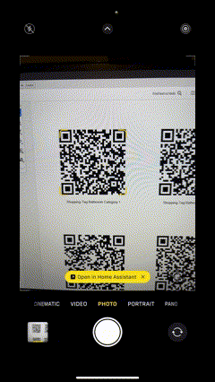

# HA-Tags Project

This project provides a Python script and a custom panel for Home Assistant to manage shopping tags.



## About Tags

The idea behind this project is to simplify and streamline the process of managing your shopping list. By placing QR code or NFC tags in strategic locations around your home, you can quickly access relevant items that you frequently purchase from that location.

For example, you might place a tag in your bathroom that, when scanned, shows a custom page with common bathroom items like toothpaste and shampoo. Similarly, a tag in your kitchen might show bread and mayonnaise. This allows you to easily add these items to your shopping list right where you notice you need them.

This approach not only saves time but also ensures that you never forget to restock essential items. The script generates PDF documents containing the QR codes, which you can print and place around your home. Future updates will include support for programming NFC tags as well.

The tags and their associated items are defined in the tags.yaml file, which is processed by the Python script to generate the QR codes and configure the custom panel in Home Assistant.

## Setup Instructions

### Prerequisites
1. Ensure you have Python installed on your system. You can download it from [python.org](https://www.python.org/).
2. Create and activate a virtual environment:
   - On Windows:
     ```bash
     python -m venv venv
     venv\Scripts\activate
     ```
   - On macOS/Linux:
     ```bash
     python3 -m venv venv
     source venv/bin/activate
     ```
3. Install the required Python dependencies by running:
   ```bash
   pip install -r requirements.txt
   ```

### Process
1. **Edit the Tags File**:
   - Open the `example-tags.yaml` file and customize it with your specific items.
   - Once edited, rename the file to `tags.yaml` and place it in the `input/` directory.

2. **Generate QR Codes**:
   - Run the Python script to process the `tags.yaml` file and generate QR codes:
     ```bash
     python main.py
     ```
   - The output, including the `shopping_tags.pdf`, will be saved in the `output/` directory.

3. **Add the Custom Panel**:
   - Copy the `shopping-tag-panel.js` file to your Home Assistant configuration directory under `www`:
     ```bash
     cp shopping-tag-panel.js /config/www/
     ```
     On Windows, you can manually copy the file to the `/config/www/` directory in your Home Assistant setup.

4. **Add the Panel Configuration**:
   - Open your `configuration.yaml` file in Home Assistant.
   - Add the following lines:
     ```yaml
     panel_custom:
       - name: shopping-tag-panel
         url_path: shopping-tag-panel
         sidebar_title: Shopping Tags
         sidebar_icon: mdi:cart
         module_url: /local/shopping-tag-panel.js
     ```

5. **Add the Script Configuration**:
   - Open the `ha-script.yaml` file in this project.
   - Copy its content and paste it into the `scripts` section of your Home Assistant configuration.

6. **Restart Home Assistant**:
   - Restart Home Assistant to apply all changes and ensure everything is working as expected.

## Notes
- Ensure the `www` directory exists in your Home Assistant configuration folder. If it does not exist, create it manually.
- After restarting Home Assistant, the custom panel should appear in the sidebar with the title "Shopping Tags."

## Troubleshooting
- If the custom panel does not appear, check the Home Assistant logs for errors.
- Verify that the `shopping-tag-panel.js` file is accessible at `http://<your-home-assistant-url>/local/shopping-tag-panel.js`.

Enjoy managing your shopping tags with ease!